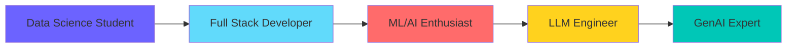

<div align="center">
  
</div>

<div align="center">
  
</div>

<p align="center">
  
  
  
</p>


## 🚀 About Me

```yaml
name: Ayesha Siddiqui
located_in: Mumbai, Maharashtra
education: B.Tech CS (Data Science) @ SPIT
cgpa: 8.91
interests: ["AI/ML", "LLM Engineering", "Full Stack"]
learning: ["GenAI", "RAG", "Fine-tuning"]
achievement: "🥉 VISTA 2025 Hackathon Runner-Up"
```

### 💡 What I'm Up To

- 🔭 Building **AI-powered applications** with LLMs
- 🌱 Exploring **RAG, LangChain, Fine-tuning**
- 💻 Creating **React + Flask** solutions
- 🎯 Open-source contributor
- 📫 **ayeshasiddiqui591@gmail.com**

<br clear="right"/>

---

## 🛠️ Tech Stack

<div align="center">
  


### 🚀 Languages


### 🌐 Frontend


### ⚙️ Backend & Database


### 🤖 AI/ML & LLM Engineering


### 🛠️ Tools


</div>

---

## 🏆 Achievements

<div align="center">
  
  
  
</div>

<div align="center">

| 🏅 Achievement | 📅 Year | 🎯 Event |
|:---|:---:|:---|
| 🥉 **2nd Runner-Up** | 2025 | VISTA Hackathon (TCET) |
| 🥇 **First Prize** | 2023 | MECH STORM - AI Job Finder |
| 🥇 **First Prize** | 2022 | State Level - Robotics Paper |
| 🌟 **Top 20 Finalist** | 2024 | Webathon (200+ participants) |

</div>

---

## 💼 Featured Projects

<div align="center">
  
</div>

<table>
<tr>
<td width="50%">

### 🛍️ Far-E-Wala
**ReactJS • Firebase • Mapbox**

GPS-powered local vendor platform
- ✅ 95% location accuracy
- ✅ Real-time tracking
- ✅ 10+ service categories

</td>
<td width="50%">

### 🎨 AI Portfolio Builder
**React • Flask • Gemini • Firebase**

AI-powered portfolio generator
- ✅ Auto-generates from resume
- ✅ 5+ templates
- ✅ Deploy in 3 minutes

</td>
</tr>

<tr>
<td width="50%">

### 📝 BlogGenie
**React • Flask • LLaMA • Gemini**

AI blog platform
- ✅ Generate in 30 seconds
- ✅ 8+ languages
- ✅ Analytics dashboard

</td>
<td width="50%">

### 💄 Korean Skin Analysis
**ReactJS • HTML • CSS**

Beauty tech platform
- ✅ 5-second processing
- ✅ 4 seasonal palettes
- ✅ 20+ shades per user

</td>
</tr>
</table>

<details>
<summary><b>🔍 View More Project Details</b></summary>
<br>

#### 💰 Fees Management System
**HTML • CSS • JavaScript • PHP • MySQL**

Multi-branch system for educational institutions with automated fee collection, real-time reporting, and optimized database queries.

#### 🔬 Additional Projects
Developed multiple projects focusing on ML/AI, web development, and data science during my academic journey at SPIT.

</details>

---

## 📊 GitHub Activity

<div align="center">
  
</div>

<div align="center">
  
</div>

<div align="center">
  
</div>

---

## 🎯 Technical Expertise

<div align="center">

```javascript
const ayesha = {
    education: "B.Tech CS (Data Science) - CGPA 8.91",
    role: "Student Developer & AI Enthusiast",
    
    skills: {
        ai_ml: ["TensorFlow", "PyTorch", "Scikit-learn", "Neural Networks"],
        llm: ["LangChain", "RAG", "Fine-tuning", "Prompt Engineering"],
        frontend: ["React", "HTML", "CSS", "JavaScript"],
        backend: ["Flask", "Firebase", "MySQL", "PHP"],
        languages: ["Python", "C++", "Java", "JavaScript", "SQL"]
    },
    
    certifications: [
        "LLM Engineering: Master AI & LLMs",
        "Machine Learning Bootcamp by Krish Naik"
    ],
    
    currentFocus: "Building AI-powered applications with LLMs",
    funFact: "Won multiple hackathons and state-level competitions! 🏆"
};
```

</div>

---

## 🌱 Current Learning Journey

<div align="center">



</div>

---

## 🤝 Connect With Me

<div align="center">
  
</div>

<p align="center">
  <a href="https://linkedin.com/in/ayeshasiddiqui" target="_blank">
    
  </a>
  <a href="https://github.com/ayeshasiddiqui" target="_blank">
    
  </a>
  <a href="https://leetcode.com/ayeshasiddiqui" target="_blank">
    
  </a>
  <a href="mailto:ayeshasiddiqui591@gmail.com">
    
  </a>
</p>

<div align="center">
  
</div>

---

<div align="center">
  
</div>

<div align="center">
  
  **💡 "Building the future, one line of code at a time"**
  
  
  
</div>

---

<div align="center">
  
</div>
